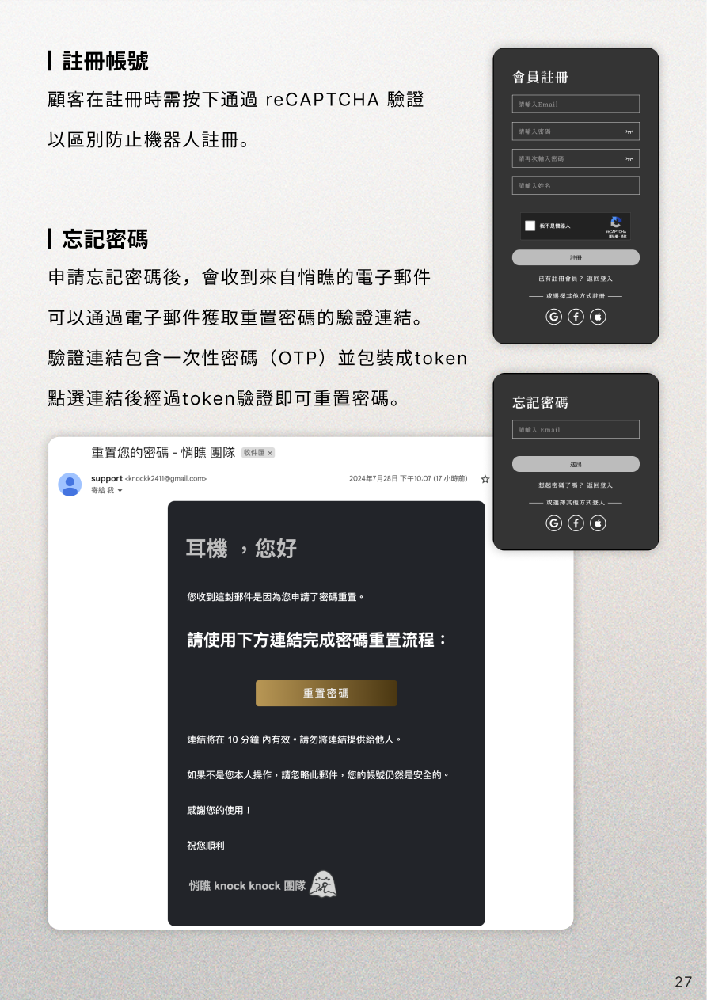

# 密室逃脫網站作品

## 網站特色

我們的網站旨在成為密室逃脫愛好者的首選平台。  
並提供北中南各地密室逃脫預約的服務。  
無論是個人或團隊，都可以輕鬆地進行線上預約，體驗刺激的逃脫遊戲。

## 網站架構

## 負責功能

### - 會員中心

> 1.  註冊功能：顧客在註冊時需通過 reCAPTCHA 驗證，以防止機器人註冊。
> 2.  登入功能：一般登入使用 JWT（JSON Web Token）進行驗證，確保顧客資料的安全。另也可以選擇使用第三方帳號進行登入。
> 3.  忘記密碼：顧客可以通過電子郵件獲取重置密碼的驗證連結。驗證連結包含一次性密碼（OTP），並以 JWT 形式進行包裝，確保連結的安全性。
> 4.  兩步驗證(2FA)：增強帳號安全性，顧客可以啟用兩步驗證功能。需要輸入通過 Google Authenticator 等 APP 生成的一次性驗證碼。
> 5.  會員資料：紀錄更新個人資訊，包含基本資料及購買時常用的地址、載具及統編資訊。顧客可以上傳代表自己的頭像，使用時可以裁剪編輯圖片再上傳。

### - 通知中心

> 1.  通知功能：使用 Server-Sent Events (SSE)：即時將通知發送給客戶端
> 2.  通知發送：可以針對單一顧客發送個人化通知，也可以向所有顧客發送全體通知，快速傳達重要資訊及優惠內容。
> 3.  通知管理：顧客可以查看過去接收到的所有通知，且可以標記通知為已讀，方便管理。

## 網站設計

## 開發及使用技術

